<div align="center">



[](https://www.linkedin.com/in/abdullah-se%C3%A7kin-71268722a/)
[](https://github.com/abdullah-seckin)


</div>

---

## 👋 About Me

I am a **Software Specialist at Robsys** based in **Istanbul**, focused on building practical, reliable and scalable software products.

I enjoy working where software meets real operations: document workflows, mobile business apps, automation, AI-assisted systems, computer vision, IoT communication and operational dashboards. My goal is to build products that are not only technically solid, but also useful for the people who rely on them every day.

```yaml
name: Abdullah SEÇKİN
location: Istanbul, Türkiye
company: Robsys
focus:
  - Full-stack product development
  - AI-assisted automation
  - Flutter mobile apps
  - Computer vision systems
  - IoT and hardware communication
  - Business workflow digitization
```

## 🚀 Featured Projects

| Project | What it does | Tech |
|---|---|---|
| [BRK Distribution](https://github.com/abdullah-seckin/brk-distribution) | Flutter/Dart distribution operations project for mobile business workflows. | Dart, Flutter, JavaScript |
| [Moper Complex](https://github.com/abdullah-seckin/moper-complex) | Flutter mobile app that helps small businesses log employee working hours. | Dart, Flutter, Dockerfile |
| [GitHub Profile README](https://github.com/abdullah-seckin/abdullah-seckin) | Visual GitHub profile landing page with project highlights, profile cards and contact links. | Markdown, SVG |
| [ISG ARSIV](https://github.com/abdullah-seckin/isgarsive-com) | Multi-tenant document management system for digitizing occupational health and safety workflows. | TypeScript, JavaScript |
| [Cam Security Guard](https://github.com/abdullah-seckin/cam-security-guard) | Computer-vision security system with real-time human detection, recording, Telegram alerts and web admin panel. | Python, OpenCV, YOLO, Flask |
| [E52 LoRa UART Library](https://github.com/abdullah-seckin/e52-xxxnw22w) | Python interface for E52 LoRa modules via UART and AT commands. | Python, UART, LoRa |

## 🧰 Tech Stack

<div align="center">


</div>

## 📌 What I Build

- Business-focused web platforms and internal tools
- Flutter mobile apps for field and workplace operations
- Multi-tenant SaaS-style workflows
- AI and computer-vision powered automation
- Python tools for hardware, sensors and communication modules
- Clean admin panels, dashboards and operational systems

## 📊 GitHub Snapshot

<div align="center">


<br />


<br />


<br />


</div>

## 🤝 Connect

<div align="center">

I am always interested in practical software ideas, automation projects and products that solve real operational problems.


[](https://www.linkedin.com/in/abdullah-se%C3%A7kin-71268722a/)

</div>

<div align="center">

</div>
